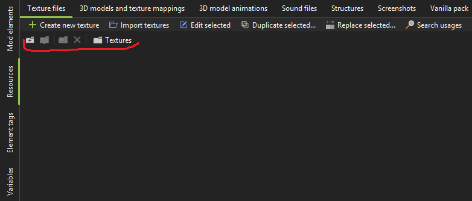

# Resource Folders

Resource Folders is a MCreator plugin that adds folders to the **Resources** tab, making it much easier to organize large projects.

Instead of having every texture, model, sound, animation, structure, or screenshot displayed in one long list, you can organize your resources into folders and subfolders directly inside MCreator.

It's completely safe to start using this plugin in already existing workspaces, even to organize resources that are already used by different mod elements.

## Features

### Organize every resource category

Each resource category has its own independent folder structure.

For example, a `Bosses` folder inside **Textures** is completely separate from a `Bosses` folder inside **Sounds**.

---

### Folders and subfolders

To create a folder you can use the <code>Create button</code> in the Resource Folders menu (the one with a <code>+</code> on it):



Then, you can enter a folder by double clicking on it. The other buttons are used to: go back, rename and delete.

Create as many folders and nested subfolders as you need.

For example:

```text
Textures
├── Blocks
├── Items
├── UI
└── Entities
    ├── Animals
    ├── NPCs
    └── Bosses
        ├── Final Boss
        └── Minibosses
```


### Import directly into folders

When you import or create a new resource while inside a folder, Resource Folders automatically places it in the folder you are currently viewing.

For example:

Textures / Entities / Bosses

If you import a new texture there, it will immediately be organized inside Bosses.

No need to import it first and move it afterward.

### Move resources between folders

Resources can be moved at any time by right-clicking on them and using the <code>Move to folder</code> option or by simply dragging and dropping them in their new location.

You can also select multiple resources and move them together.

Moving a resource back to the main resource category places it in the root folder again.